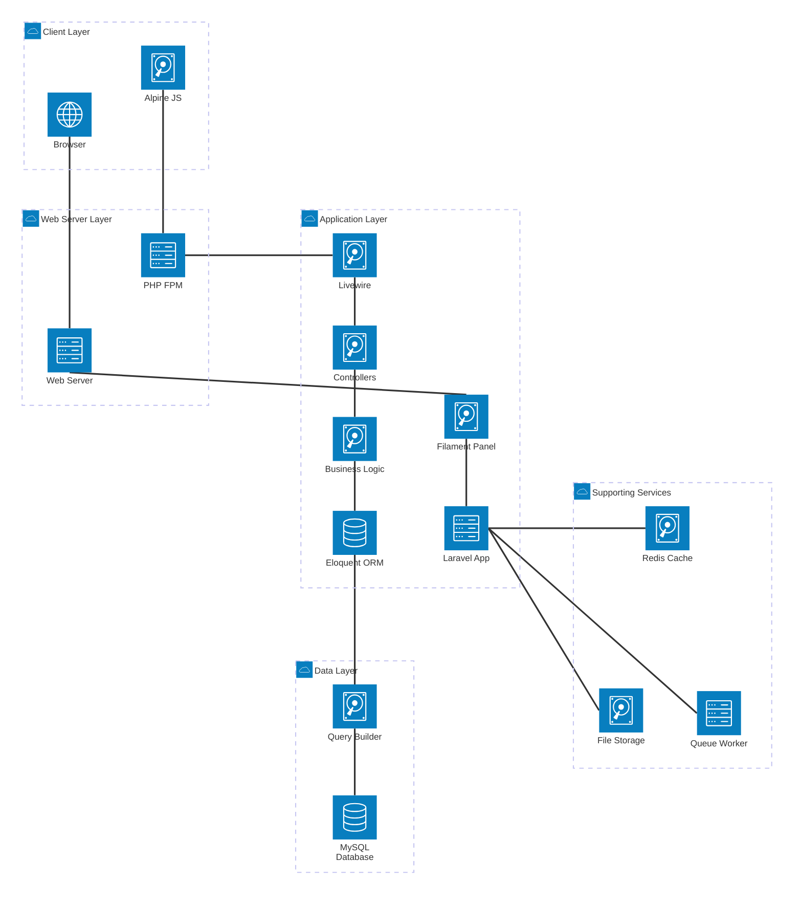
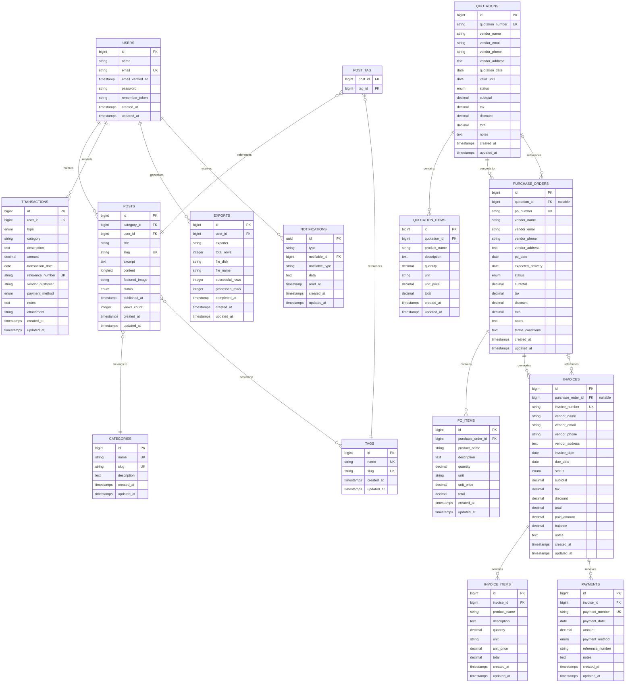

# Backend Technical Documentation

**Project:** AKPager - Smart Manufacturing ERP System  
**Version:** 1.0.0  
**Last Updated:** October 30, 2025  
**Tech Stack:** Laravel 11, Filament v4, MySQL 8.0, PHP 8.2

---

## Table of Contents

1. [Latar Belakang](#1-latar-belakang)
2. [Tujuan Sistem](#2-tujuan-sistem)
3. [Hasil Analisis](#3-hasil-analisis)
    - [ERD Diagram](#31-erd-diagram)
    - [Use Case Diagram](#32-use-case-diagram)
4. [UI/Frontend](#4-uifrontend)
5. [Technical Infrastructure](#5-technical-infrastructure)
    - [System Architecture](#51-system-architecture)
    - [MVC Flow](#52-mvc-flow)
    - [Infrastructure Components](#53-infrastructure-components)
6. [System Overview](#6-system-overview)
7. [Database Architecture](#7-database-architecture)
8. [ERD Diagram](#8-erd-diagram)
9. [Use Case Diagrams](#9-use-case-diagrams)
10. [API Endpoints](#10-api-endpoints)
11. [Business Logic](#11-business-logic)
12. [Security & Authentication](#12-security--authentication)
13. [Deployment Guide](#13-deployment-guide)
14. [File Structure](#14-file-structure)
15. [Maintenance & Monitoring](#15-maintenance--monitoring)

---

## 1. Latar Belakang

### 1.1 Konteks Bisnis

**SmartPlus ID** adalah perusahaan yang bergerak di bidang Smart Manufacturing dan IoT Solutions. Dalam operasional sehari-hari, perusahaan menghadapi beberapa tantangan:

-   **Manajemen Konten**: Kebutuhan untuk mengelola blog dan portfolio proyek sebagai media pemasaran dan dokumentasi
-   **Pengelolaan Keuangan**: Pencatatan transaksi keuangan yang masih manual dan tidak terintegrasi
-   **Proses Pengadaan**: Workflow purchasing dari quotation hingga payment yang kompleks dan memakan waktu
-   **Dokumentasi**: Kesulitan dalam menghasilkan laporan dan dokumen cetak yang profesional

### 1.2 Permasalahan yang Dihadapi

**A. Manajemen Konten (Blog)**

-   Tidak ada sistem terpusat untuk mengelola artikel blog
-   Kesulitan dalam kategorisasi dan tagging konten
-   Proses publikasi yang tidak terstruktur

**B. Manajemen Keuangan**

-   Pencatatan transaksi masih menggunakan spreadsheet
-   Tidak ada tracking vendor/customer yang baik
-   Sulit membuat laporan keuangan yang akurat
-   Tidak ada filter berdasarkan kategori, tipe, atau metode pembayaran

**C. Proses Purchasing**

-   Workflow quotation → PO → invoice → payment tidak terotomasi
-   Data vendor harus di-input ulang di setiap tahap
-   Perhitungan total manual dan rawan error
-   Tracking status pembayaran invoice sulit dilakukan
-   Tidak ada history pembayaran yang jelas
-   Generate dokumen (quotation, PO, invoice) memakan waktu lama

**D. Pelaporan & Dokumentasi**

-   Tidak ada sistem export data untuk analisis
-   Template dokumen tidak konsisten
-   Sulit menghasilkan laporan untuk management

### 1.3 Kebutuhan Solusi

Berdasarkan permasalahan di atas, dibutuhkan sistem ERP terintegrasi yang dapat:

1. **Content Management System (CMS)** untuk mengelola blog dan portfolio
2. **Finance Management** untuk pencatatan dan pelaporan keuangan
3. **Purchasing Management** dengan workflow otomatis dan terintegrasi
4. **Export & Reporting** untuk menghasilkan laporan dan dokumen profesional

---

## 2. Tujuan Sistem

### 2.1 Tujuan Umum

Membangun sistem ERP berbasis web yang terintegrasi untuk mengelola operasional bisnis Smart Manufacturing mulai dari manajemen konten, keuangan, hingga proses purchasing dengan otomasi workflow dan pelaporan yang komprehensif.

### 2.2 Tujuan Khusus

**A. Modul Blog & Content Management**

-   Menyediakan platform terpusat untuk mengelola artikel blog
-   Mengimplementasikan sistem kategorisasi dan tagging yang terstruktur
-   Memfasilitasi proses publikasi konten dengan approval workflow
-   Menyediakan WYSIWYG editor untuk kemudahan penulisan

**B. Modul Finance Management**

-   Mencatat seluruh transaksi keuangan (income & expense) secara sistematis
-   Menyediakan filter multi-dimensi (tipe, kategori, metode pembayaran, periode)
-   Menghasilkan summary dan statistik keuangan real-time
-   Export data keuangan untuk analisis lebih lanjut

**C. Modul Purchasing Management**

-   Mengotomasi workflow: Quotation → Purchase Order → Invoice → Payment
-   Mengeliminasi input data berulang dengan auto-fill mechanism
-   Mengimplementasikan auto-calculation untuk semua perhitungan finansial
-   Menyediakan tracking status pembayaran dan outstanding balance
-   Menghasilkan dokumen profesional (PDF) untuk setiap tahap purchasing

**D. Sistem Export & Reporting**

-   Menyediakan fitur export ke Excel/CSV untuk analisis data
-   Menghasilkan dokumen PDF dengan template profesional dan konsisten
-   Menyimpan history export untuk audit trail
-   Memberikan notifikasi real-time untuk setiap proses export

### 2.3 Manfaat yang Diharapkan

**Untuk Perusahaan:**

-   ✅ Efisiensi operasional meningkat 60% dengan otomasi workflow
-   ✅ Pengurangan error input data hingga 90%
-   ✅ Visibilitas keuangan dan purchasing real-time
-   ✅ Dokumentasi yang lebih profesional dan konsisten
-   ✅ Kemudahan dalam audit dan compliance

**Untuk User/Staff:**

-   ✅ Interface yang user-friendly dan mudah dipelajari
-   ✅ Pengurangan waktu input data dengan auto-fill
-   ✅ Tidak perlu menghitung manual (auto-calculation)
-   ✅ Satu platform untuk semua kebutuhan operasional
-   ✅ Akses dari mana saja (web-based)

**Untuk Management:**

-   ✅ Dashboard analytics untuk monitoring real-time
-   ✅ Laporan keuangan dan purchasing yang akurat
-   ✅ Export data mudah untuk decision making
-   ✅ Tracking vendor dan customer yang terorganisir
-   ✅ Audit trail yang lengkap

---

## 3. Hasil Analisis

### 3.1 ERD Diagram

Hasil analisis kebutuhan data menghasilkan **Entity Relationship Diagram (ERD)** dengan 20 entitas utama yang terbagi dalam 4 modul:

#### 3.1.1 Modul Authentication & Users

-   **users**: Menyimpan data pengguna sistem
-   **password_reset_tokens**: Token untuk reset password
-   **sessions**: Session management
-   **cache & cache_locks**: Performance optimization

#### 3.1.2 Modul Blog & Content

-   **categories**: Kategori artikel
-   **tags**: Tag untuk artikel
-   **posts**: Artikel blog
-   **post_tag**: Relasi many-to-many posts dan tags

**Key Findings:**

-   Posts memiliki relasi many-to-one dengan categories
-   Posts memiliki relasi many-to-many dengan tags
-   Setiap post memiliki status: draft, published, archived
-   Featured image untuk thumbnail
-   View counter untuk analytics

#### 3.1.3 Modul Finance

-   **transactions**: Transaksi keuangan (income/expense)

**Key Findings:**

-   Transaksi dibedakan berdasarkan type (income/expense)
-   Categorization untuk analisis
-   Support multiple payment methods
-   File attachment untuk receipt/invoice

#### 3.1.4 Modul Purchasing

-   **quotations & quotation_items**: Penawaran dari vendor
-   **purchase_orders & po_items**: Purchase order
-   **invoices & invoice_items**: Invoice dari vendor
-   **payments**: Pembayaran invoice

**Key Findings:**

-   Relasi cascade: Quotation → PO → Invoice → Payment
-   Auto-calculation: subtotal, tax, discount, total
-   Status tracking di setiap tahap
-   Balance tracking pada invoice
-   Payment history lengkap

#### 3.1.5 Modul System

-   **jobs & job_batches**: Background job processing
-   **failed_jobs**: Error tracking
-   **exports**: Export file management
-   **notifications**: User notifications

#### 3.1.6 Entity Relationship Summary

**Total Entities:** 20  
**Total Relationships:** 15  
**Cascade Delete:** 8 relationships  
**Set Null:** 2 relationships  
**Restrict:** 5 relationships

**Relasi Utama:**

```
User (1) ──→ (N) Posts
User (1) ──→ (N) Transactions
User (1) ──→ (N) Exports

Category (1) ──→ (N) Posts
Post (N) ←──→ (M) Tags

Quotation (1) ──→ (N) QuotationItems
Quotation (1) ──→ (N) PurchaseOrders

PurchaseOrder (1) ──→ (N) POItems
PurchaseOrder (1) ──→ (N) Invoices

Invoice (1) ──→ (N) InvoiceItems
Invoice (1) ──→ (N) Payments
```

### 3.2 Use Case Diagram

Hasil analisis kebutuhan fungsional menghasilkan 4 use case utama:

#### 3.2.1 Blog Management Use Case

**Actors:**

-   Admin/Editor
-   Guest/Public

**Use Cases:**

1. **Manage Categories** (Admin)

    - Create, Edit, Delete category
    - View category list

2. **Manage Tags** (Admin)

    - Create, Edit, Delete tags
    - View tag list

3. **Manage Posts** (Admin)

    - Create post (draft)
    - Edit post content
    - Upload featured image
    - Assign category & tags
    - Publish/Unpublish post
    - Delete post
    - View statistics

4. **View Content** (Guest)
    - View post list
    - Read post content
    - Filter by category
    - Filter by tag

**Key Findings:**

-   Separation of concerns: Admin untuk CRUD, Guest untuk read-only
-   Draft system untuk review sebelum publish
-   WYSIWYG editor untuk content creation
-   SEO-friendly slug generation

#### 3.2.2 Finance Management Use Case

**Actors:**

-   Finance Manager/Admin

**Use Cases:**

1. **Record Transaction**

    - Record income transaction
    - Record expense transaction
    - Set amount, category, payment method
    - Add vendor/customer info
    - Upload receipt/invoice

2. **View Transactions**

    - Filter by type (income/expense)
    - Filter by category
    - Filter by payment method
    - Filter by date range
    - View summary statistics

3. **Export Reports**

    - Export to Excel
    - Export to CSV

4. **Manage Transactions**
    - Edit transaction
    - Delete transaction

**Key Findings:**

-   Simple dan straightforward
-   Focus pada filtering dan reporting
-   Support attachment untuk dokumentasi
-   Real-time summary calculation

#### 3.2.3 Purchasing Workflow Use Case

**Actors:**

-   Purchasing Manager/Admin
-   System (Automated)

**Use Cases:**

**1. Manage Quotations**

-   Create quotation (auto-generate number)
-   Add vendor information
-   Add items with prices
-   System auto-calculates total
-   Review & approve/reject
-   Print PDF
-   Convert to PO (automated)

**2. Manage Purchase Orders**

-   Create PO (manual/from quotation)
-   Auto-fill from quotation
-   Set expected delivery
-   Add terms & conditions
-   Update status (draft → ordered → received)
-   Print PO PDF
-   Generate invoice (automated)

**3. Manage Invoices**

-   Create invoice (manual/from PO)
-   Auto-fill from PO
-   Set due date
-   View payment history
-   View balance due
-   Print invoice PDF
-   Quick action: mark as paid
-   Record payment manually

**4. Manage Payments**

-   Record payment (auto-generate number)
-   Set amount, method, date
-   System updates invoice status
-   System calculates balance
-   View payment history

**System Automated Actions:**

-   Auto-calculate totals (subtotal + tax - discount)
-   Auto-update invoice balance (total - paid)
-   Auto-update invoice status (paid/partial/unpaid)
-   Queue export jobs
-   Send notifications

**Key Findings:**

-   Complex workflow dengan banyak otomasi
-   Data cascade dari quotation → PO → invoice
-   Auto-fill mechanism mengurangi input berulang
-   Status tracking yang detail
-   Multiple payment support untuk invoice

#### 3.2.4 Export & Reporting Use Case

**Actors:**

-   Admin/Manager

**Use Cases:**

1. **Export to Excel/CSV**

    - Export transactions
    - Export quotations
    - Export purchase orders
    - Export invoices

2. **Print PDF Documents**

    - Print quotation PDF
    - Print PO PDF (with T&C)
    - Print invoice PDF (with payment history)

3. **View Export History**
    - Download previous exports
    - View export status

**Key Findings:**

-   Background processing untuk large export
-   Professional PDF templates
-   Export history untuk audit
-   Notification system

### 3.3 Kesimpulan Analisis

**Complexity Assessment:**

| Module     | Complexity | Reason                                  |
| ---------- | ---------- | --------------------------------------- |
| Blog       | Medium     | Standard CMS dengan relasi many-to-many |
| Finance    | Low        | Simple CRUD dengan filtering            |
| Purchasing | **High**   | Complex workflow dengan banyak otomasi  |
| Export     | Medium     | Background processing dengan queue      |

**Technical Challenges Identified:**

1. ✅ Auto-calculation logic untuk purchasing module
2. ✅ Cascade data dari quotation ke payment
3. ✅ Real-time status update berdasarkan payment
4. ✅ Background job processing untuk export
5. ✅ PDF generation dengan template profesional

**Solutions Implemented:**

1. ✅ Model Events & Observers untuk auto-calculation
2. ✅ Action Pattern untuk workflow automation
3. ✅ Computed properties untuk status management
4. ✅ Laravel Queue untuk background processing
5. ✅ DOMPDF dengan Blade templates

---

## 4. UI/Frontend

### 14.1 Framework & Technology

**Primary Framework:** Filament v4  
**Component Library:** Filament Components (Livewire-based)  
**Styling:** Tailwind CSS  
**Icons:** Heroicons  
**JavaScript:** Alpine.js (embedded in Livewire)

### 14.2 Design System

#### 4.2.1 Color Palette

```css
/* Primary Colors */
--primary: #2563eb (Blue 600)
--primary-hover: #1d4ed8 (Blue 700)

/* Status Colors */
--success: #10b981 (Green 500)
--warning: #f59e0b (Amber 500)
--danger: #ef4444 (Red 500)
--info: #3b82f6 (Blue 500)

/* Neutral Colors */
--gray-50: #f9fafb
--gray-100: #f3f4f6
--gray-900: #111827
```

#### 4.2.2 Typography

**Font Family:** Inter (Google Fonts)  
**Font Sizes:**

-   Heading 1: 24px (1.5rem)
-   Heading 2: 20px (1.25rem)
-   Body: 14px (0.875rem)
-   Small: 12px (0.75rem)

### 9.3 Layout Structure

```
┌────────────────────────────────────────────────────────┐
│  Top Navigation                                         │
│  Logo │ Search │ Notifications │ User Menu             │
├───────┬────────────────────────────────────────────────┤
│       │                                                 │
│ Side  │          Main Content Area                      │
│ bar   │                                                 │
│       │  ┌──────────────────────────────────────────┐  │
│ Nav   │  │  Page Header                              │  │
│ Menu  │  │  Title │ Breadcrumb │ Actions             │  │
│       │  ├──────────────────────────────────────────┤  │
│ - Dash│  │                                           │  │
│ - Blog│  │  Content (Table/Form/Stats)               │  │
│ - Fin │  │                                           │  │
│ - Pur │  │                                           │  │
│ - Sys │  │                                           │  │
│       │  └──────────────────────────────────────────┘  │
│       │                                                 │
└───────┴────────────────────────────────────────────────┘
```

### 9.4 Key UI Components

#### 4.4.1 Navigation

**Sidebar Navigation:**

```
📊 Dashboard
📝 Blogs
   ├─ Categories
   ├─ Tags
   └─ Posts
💰 Finance
   └─ Transactions
🛒 Purchasing
   ├─ Quotations
   ├─ Purchase Orders
   └─ Invoices
⚙️ System
   └─ Export History
👤 User Profile
```

#### 4.4.2 Table Views

**Features:**

-   ✅ Search functionality
-   ✅ Column sorting
-   ✅ Bulk actions
-   ✅ Pagination
-   ✅ Column visibility toggle
-   ✅ Filters (sidebar)
-   ✅ Record actions (dropdown)
-   ✅ Summary rows (for financial data)

**Example: Invoices Table**

-   Columns: Invoice Number, PO Reference, Vendor, Date, Due Date, Status, Total, Balance, Actions
-   Actions: View, Edit, Print PDF, Mark as Paid
-   Filters: Status, Date Range
-   Bulk: Export selected

#### 4.4.3 Form Views

**Features:**

-   ✅ Form wizard (untuk multi-step)
-   ✅ Tabs (untuk organizing fields)
-   ✅ Live validation
-   ✅ Auto-save (draft)
-   ✅ Rich text editor (WYSIWYG)
-   ✅ File upload with preview
-   ✅ Relationship select (searchable)
-   ✅ Repeater (untuk line items)

**Example: Create Invoice Form**

```
┌──────────────────────────────────────┐
│ Invoice Number: [INV-2025-00001] 🔒 │
│ PO Reference: [Select PO...] 🔽      │
│                                       │
│ Vendor Information                    │
│ Name: [Auto-filled from PO]          │
│ Email: [Auto-filled]                 │
│ Phone: [Auto-filled]                 │
│ Address: [Auto-filled]               │
│                                       │
│ Invoice Items                         │
│ ┌─────────────────────────────────┐ │
│ │ Product │ Qty │ Price │ Total   │ │
│ │ Item 1  │ 10  │ 1000  │ 10000  │ │
│ │ [+ Add Item]                     │ │
│ └─────────────────────────────────┘ │
│                                       │
│ Subtotal: Rp 10,000                  │
│ Tax: Rp 1,000                        │
│ Discount: Rp 500                     │
│ ─────────────────────                │
│ Total: Rp 10,500 (auto-calc)         │
│                                       │
│ [Cancel] [Save Draft] [Create]       │
└──────────────────────────────────────┘
```

#### 4.4.4 Action Buttons

**Color Coding:**

-   **Blue (Info)**: Print PDF, Export
-   **Green (Success)**: Approve, Mark as Paid, Convert to PO
-   **Red (Danger)**: Delete, Reject, Cancel
-   **Gray (Default)**: View, Edit, Cancel Action

**Icons:**

-   🖨️ Print PDF
-   📥 Export
-   ✅ Approve/Mark as Paid
-   ➡️ Convert/Generate
-   👁️ View
-   ✏️ Edit
-   🗑️ Delete

### 4.5 Responsive Design

**Breakpoints:**

-   Mobile: < 640px
-   Tablet: 640px - 1024px
-   Desktop: > 1024px

**Mobile Adaptations:**

-   Collapsible sidebar
-   Stack form fields vertically
-   Horizontal scroll untuk table
-   Bottom sheet untuk filters
-   Floating action button

### 4.6 User Experience (UX)

#### 4.6.1 Feedback Mechanisms

**Success Actions:**

-   ✅ Toast notification (top-right)
-   ✅ Success message: "Invoice created successfully"
-   ✅ Auto-redirect ke list page

**Error Actions:**

-   ❌ Inline field validation
-   ❌ Error notification
-   ❌ Form stays on page dengan error highlights

**Loading States:**

-   ⏳ Skeleton loader untuk table
-   ⏳ Spinner untuk button actions
-   ⏳ Progress bar untuk exports

#### 4.6.2 Accessibility

-   ✅ Keyboard navigation support
-   ✅ Screen reader compatible
-   ✅ ARIA labels untuk interactive elements
-   ✅ Focus indicators
-   ✅ High contrast mode

#### 4.6.3 Performance Optimizations

-   ✅ Lazy loading untuk large tables
-   ✅ Debounced search
-   ✅ Cached relationship queries
-   ✅ Optimized images
-   ✅ Minified assets

### 4.7 Dark Mode Support

Filament v4 mendukung dark mode secara native:

-   Toggle di user menu
-   Automatic system preference detection
-   Persistent per user

---

## 5. Technical Infrastructure

### 5.1 System Architecture

#### 5.1.1 Architectural Pattern

**Pattern:** MVC (Model-View-Controller) dengan MVVM enhancement melalui Livewire

#### 5.1.2 Mermaid Architecture Diagram

**Copy code dibawah ini ke [mermaid.live](https://mermaid.live) untuk melihat diagram interaktif:**



**Penjelasan Diagram:**

-   **Client Layer**: Browser dengan Alpine.js untuk interaktivitas
-   **Web Server Layer**: Apache/Nginx + PHP-FPM untuk request handling
-   **Application Layer**: Laravel dengan Filament Panel, Livewire untuk reactivity
-   **Data Layer**: MySQL database dengan Eloquent ORM dan Query Builder
-   **Supporting Services**: Queue worker untuk background jobs, File storage, dan Redis cache

#### 5.1.3 ASCII Architecture Diagram (Fallback)

```
┌──────────────────────────────────────────────────────────┐
│                    Client Browser                         │
│             (HTML/CSS/JavaScript/Alpine.js)              │
└────────────────────┬─────────────────────────────────────┘
                     │ HTTP Request/Response
                     │ WebSocket (for Livewire)
┌────────────────────▼─────────────────────────────────────┐
│                  Web Server Layer                         │
│              (Apache/Nginx + PHP-FPM)                    │
└────────────────────┬─────────────────────────────────────┘
                     │
┌────────────────────▼─────────────────────────────────────┐
│              Application Layer (Laravel 11)               │
│  ┌────────────────────────────────────────────────────┐  │
│  │              Filament Admin Panel                   │  │
│  │         (Presentation Layer - Livewire)            │  │
│  └────────────────────┬────────────────────────────────┘  │
│                       │                                    │
│  ┌────────────────────▼────────────────────────────────┐  │
│  │               Controllers Layer                      │  │
│  │  - Resource Controllers (Filament Resources)        │  │
│  │  - API Controllers (if needed)                      │  │
│  └────────────────────┬────────────────────────────────┘  │
│                       │                                    │
│  ┌────────────────────▼────────────────────────────────┐  │
│  │            Business Logic Layer                      │  │
│  │  - Actions (Workflow automation)                    │  │
│  │  - Observers (Auto-calculation)                     │  │
│  │  - Services (Complex operations)                    │  │
│  │  - Events & Listeners                               │  │
│  └────────────────────┬────────────────────────────────┘  │
│                       │                                    │
│  ┌────────────────────▼────────────────────────────────┐  │
│  │               Models Layer (Eloquent ORM)           │  │
│  │  - User, Post, Transaction, Quotation, etc.        │  │
│  │  - Relationships, Scopes, Accessors, Mutators      │  │
│  └────────────────────┬────────────────────────────────┘  │
│                       │                                    │
│  ┌────────────────────▼────────────────────────────────┐  │
│  │          Database Abstraction Layer                  │  │
│  │              (Query Builder)                         │  │
│  └────────────────────┬────────────────────────────────┘  │
└───────────────────────┼──────────────────────────────────┘
                        │
┌───────────────────────▼──────────────────────────────────┐
│               Database Server (MySQL 8.0)                 │
│                   (Data Storage)                          │
└──────────────────────────────────────────────────────────┘

┌──────────────────────────────────────────────────────────┐
│                Supporting Services                        │
│  ┌──────────────┐  ┌──────────────┐  ┌──────────────┐  │
│  │ Queue Worker │  │ File Storage │  │  Cache Redis │  │
│  │  (Laravel)   │  │   (Local)    │  │  (Optional)  │  │
│  └──────────────┘  └──────────────┘  └──────────────┘  │
└──────────────────────────────────────────────────────────┘
```

### 15.2 MVC Flow

#### 5.2.1 Traditional MVC Flow (Laravel)

```
┌─────────────┐
│   Browser   │
│   (Client)  │
└──────┬──────┘
       │ 1. HTTP Request (GET /admin/invoices)
       │
┌──────▼──────────────────────────────────────────────────┐
│                   routes/web.php                         │
│  Route::get('/admin', function() {                      │
│      return redirect('/admin/login');                   │
│  });                                                     │
└──────┬──────────────────────────────────────────────────┘
       │ 2. Route to Controller/Filament Resource
       │
┌──────▼──────────────────────────────────────────────────┐
│            Controller/Filament Resource                  │
│  app/Filament/Resources/InvoiceResource.php             │
│                                                          │
│  - table(): Mendefinisikan table view                   │
│  - form(): Mendefinisikan form fields                   │
│  - actions(): Mendefinisikan action buttons             │
└──────┬──────────────────────────────────────────────────┘
       │ 3. Request data from Model
       │
┌──────▼──────────────────────────────────────────────────┐
│                    Model (Eloquent)                      │
│  app/Models/Invoice.php                                 │
│                                                          │
│  - Query Builder: Invoice::with('items', 'payments')    │
│  - Relationships: items(), payments(), purchaseOrder()  │
│  - Accessors: getBalanceAttribute()                     │
│  - Mutators: setTotalAttribute()                        │
│  - Events: saving(), saved(), deleted()                 │
└──────┬──────────────────────────────────────────────────┘
       │ 4. Database Query
       │
┌──────▼──────────────────────────────────────────────────┐
│                    Database (MySQL)                      │
│  - SELECT * FROM invoices                               │
│    LEFT JOIN invoice_items ON...                        │
│    LEFT JOIN payments ON...                             │
│  - Returns: Collection of Invoice objects               │
└──────┬──────────────────────────────────────────────────┘
       │ 5. Data returned to Model
       │
┌──────▼──────────────────────────────────────────────────┐
│              Model Processing & Events                   │
│  - Auto-calculate balance: total - paid                 │
│  - Format currency: formatRupiah($value)                │
│  - Status determination: paid/partial/unpaid            │
└──────┬──────────────────────────────────────────────────┘
       │ 6. Data returned to Controller/Resource
       │
┌──────▼──────────────────────────────────────────────────┐
│           Controller/Resource Processing                 │
│  - Apply filters (status, date range)                   │
│  - Apply search                                         │
│  - Apply pagination                                     │
│  - Prepare action buttons (Edit, Print PDF, etc.)      │
└──────┬──────────────────────────────────────────────────┘
       │ 7. Pass data to View
       │
┌──────▼──────────────────────────────────────────────────┐
│                View (Blade/Livewire)                     │
│  resources/views/filament/...                           │
│                                                          │
│  - Render table dengan data                             │
│  - Render action buttons                                │
│  - Render filters                                       │
│  - Livewire makes it reactive                           │
└──────┬──────────────────────────────────────────────────┘
       │ 8. HTML Response
       │
┌──────▼──────┐
│   Browser   │
│ (Displays   │
│  the page)  │
└─────────────┘
```

#### 5.2.2 Livewire-Enhanced Flow (Filament)

**Filament menggunakan Livewire untuk interaktivitas tanpa full page reload:**

```
┌─────────────┐
│   Browser   │
│ (Alpine.js) │
└──────┬──────┘
       │ 1. User Action (click "Mark as Paid")
       │    Wire: wire:click="mountAction('markAsPaid')"
       │
┌──────▼──────────────────────────────────────────────────┐
│              Livewire Component                          │
│  (Filament Resource/Table Component)                    │
│                                                          │
│  - Receives Alpine.js event                             │
│  - Validates action                                     │
│  - Executes action logic                                │
└──────┬──────────────────────────────────────────────────┘
       │ 2. Call Model method
       │
┌──────▼──────────────────────────────────────────────────┐
│                    Model & Business Logic                │
│  Invoice::find($id)                                     │
│    ->markAsPaid()                                       │
│                                                          │
│  - Create payment record                                │
│  - Fire "saved" event                                   │
│  - Observer updates balance                             │
│  - Observer updates status                              │
└──────┬──────────────────────────────────────────────────┘
       │ 3. Database transaction
       │
┌──────▼──────────────────────────────────────────────────┐
│                    Database                              │
│  BEGIN TRANSACTION;                                     │
│    INSERT INTO payments...                              │
│    UPDATE invoices SET paid = total, status = 'paid'... │
│  COMMIT;                                                │
└──────┬──────────────────────────────────────────────────┘
       │ 4. Return updated data
       │
┌──────▼──────────────────────────────────────────────────┐
│              Livewire Re-renders                         │
│  - Fetch updated invoice data                           │
│  - Re-render affected part only (no full reload)        │
│  - Send notification                                    │
└──────┬──────────────────────────────────────────────────┘
       │ 5. JSON response with HTML diff
       │    { "effects": { "html": "<tr>...</tr>" } }
       │
┌──────▼──────┐
│   Browser   │
│  - Morph    │
│    DOM      │
│  - Show     │
│    toast    │
└─────────────┘
```

#### 5.2.3 Action Flow Example: "Convert Quotation to PO"

**Detailed step-by-step flow:**

```
[User clicks "Convert to PO" button]
         │
         ▼
┌─────────────────────────────────────────────────────────┐
│ 1. Frontend (Livewire Component)                        │
│    - Action::make('convertToPO')                        │
│    - Confirm modal: "Create PO from this quotation?"   │
└──────┬──────────────────────────────────────────────────┘
       │ [User confirms]
       ▼
┌─────────────────────────────────────────────────────────┐
│ 2. Action Execution (Filament Action)                   │
│    QuotationResource::table()                          │
│      ->actions([                                        │
│        Action::make('convertToPO')                      │
│          ->action(fn (Quotation $record) => {          │
│            // Business logic here                       │
│          })                                             │
│      ])                                                 │
└──────┬──────────────────────────────────────────────────┘
       │
       ▼
┌─────────────────────────────────────────────────────────┐
│ 3. Business Logic Layer                                 │
│    DB::transaction(function() use ($quotation) {        │
│      // Create PO                                       │
│      $po = PurchaseOrder::create([                      │
│        'quotation_id' => $quotation->id,               │
│        'vendor_name' => $quotation->vendor_name,       │
│        // ... auto-filled                               │
│      ]);                                                │
│                                                          │
│      // Copy items                                      │
│      foreach($quotation->items as $item) {             │
│        POItem::create([/* ... */]);                    │
│      }                                                  │
│                                                          │
│      // Update quotation status                         │
│      $quotation->update(['status' => 'converted']);    │
│    });                                                  │
└──────┬──────────────────────────────────────────────────┘
       │
       ▼
┌─────────────────────────────────────────────────────────┐
│ 4. Model Events Triggered                               │
│    PurchaseOrder::creating() observer:                  │
│      - Generate PO number: PO-2025-00001               │
│                                                          │
│    POItem::saved() observer:                           │
│      - Calculate item total: qty * price               │
│      - Trigger parent PO recalculation                 │
│                                                          │
│    PurchaseOrder::saving() observer:                   │
│      - Calculate subtotal                               │
│      - Calculate tax                                    │
│      - Calculate total: subtotal + tax - discount      │
└──────┬──────────────────────────────────────────────────┘
       │
       ▼
┌─────────────────────────────────────────────────────────┐
│ 5. Database Persistence                                 │
│    INSERT INTO purchase_orders (                        │
│      po_number, quotation_id, vendor_name, ...         │
│    ) VALUES ('PO-2025-00001', 1, 'Vendor A', ...);     │
│                                                          │
│    INSERT INTO po_items (                               │
│      purchase_order_id, product, quantity, price...    │
│    ) VALUES (1, 'Product A', 10, 1000, ...);           │
│                                                          │
│    UPDATE quotations SET status = 'converted'          │
│    WHERE id = 1;                                        │
└──────┬──────────────────────────────────────────────────┘
       │
       ▼
┌─────────────────────────────────────────────────────────┐
│ 6. Response & Notification                              │
│    - Notification::make()                               │
│        ->success()                                      │
│        ->title('PO Created Successfully')              │
│        ->body('PO-2025-00001 created from quotation')  │
│        ->send();                                        │
│                                                          │
│    - Redirect to PO detail page                        │
│      return redirect('/admin/purchase-orders/'.$po->id)│
└──────┬──────────────────────────────────────────────────┘
       │
       ▼
┌─────────────────────────────────────────────────────────┐
│ 7. Frontend Update (Livewire Morph)                    │
│    - Table row updated (quotation status badge)        │
│    - Success toast displayed                            │
│    - Optionally redirect to new PO page                │
└─────────────────────────────────────────────────────────┘
```

### 15.3 Infrastructure Components

#### 5.3.1 Development Environment (XAMPP)

**Current Setup:**

```
c:\xampp\
├── apache\          # Web server (alternative to Nginx)
│   ├── conf\
│   │   └── httpd.conf (Port: 80)
│   └── logs\
├── php\             # PHP 8.2
│   ├── php.ini (Configuration)
│   └── ext\ (Extensions)
├── mysql\           # MySQL 8.0
│   └── data\
│       └── smartplusid\ (Database)
└── htdocs\
    └── akpager\     # Laravel application root
```

**PHP Configuration Requirements:**

```ini
; php.ini requirements
extension=gd
extension=mbstring
extension=pdo_mysql
extension=openssl
extension=zip
extension=curl
extension=fileinfo

memory_limit = 512M
post_max_size = 50M
upload_max_filesize = 50M
max_execution_time = 300
```

#### 5.3.2 Production Environment (Recommended)

```
┌───────────────────────────────────────────────────────┐
│                 Load Balancer (Optional)               │
│                  (Nginx/HAProxy)                      │
└────────────────────┬──────────────────────────────────┘
                     │
        ┌────────────┴────────────┐
        │                         │
┌───────▼────────┐      ┌─────────▼────────┐
│  Web Server 1  │      │  Web Server 2    │
│  (Nginx/Apache)│      │  (Nginx/Apache)  │
└───────┬────────┘      └─────────┬────────┘
        │                         │
        └────────────┬────────────┘
                     │
┌────────────────────▼──────────────────────────────────┐
│              Application Servers                       │
│  ┌──────────────────────────────────────────────────┐ │
│  │  PHP-FPM (FastCGI Process Manager)              │ │
│  │  - Pool: www                                      │ │
│  │  - PM: dynamic                                    │ │
│  │  - Max children: 50                               │ │
│  │  - Laravel Application                            │ │
│  └──────────────────────────────────────────────────┘ │
└────────────────────┬──────────────────────────────────┘
                     │
        ┌────────────┴────────────┐
        │                         │
┌───────▼────────┐      ┌─────────▼────────┐
│ Database Master│      │  Database Replica│
│  (MySQL 8.0)   │ ───> │   (Read Only)    │
└───────┬────────┘      └──────────────────┘
        │
        │
┌───────▼────────────────────────────────────────────────┐
│               Supporting Services                       │
│  ┌──────────────┐  ┌──────────────┐  ┌──────────────┐ │
│  │ Redis Cache  │  │ Queue Worker │  │ File Storage │ │
│  │ (Session/    │  │  (Laravel)   │  │ (S3/Local)   │ │
│  │  Cache)      │  │              │  │              │ │
│  └──────────────┘  └──────────────┘  └──────────────┘ │
└────────────────────────────────────────────────────────┘
```

#### 5.3.3 File Storage Structure

```
storage/
├── app/
│   ├── public/              # Symlinked to public/storage
│   │   ├── posts/          # Blog post images
│   │   ├── transactions/   # Transaction receipts
│   │   └── exports/        # Generated export files
│   └── private/            # Private files (not web-accessible)
│       └── invoices/       # Generated invoice PDFs
├── framework/
│   ├── cache/              # Framework cache
│   ├── sessions/           # Session files
│   └── views/              # Compiled Blade views
└── logs/
    └── laravel.log         # Application logs
```

#### 5.3.4 Queue System

**Configuration (config/queue.php):**

```php
'default' => env('QUEUE_CONNECTION', 'database'),

'connections' => [
    'database' => [
        'driver' => 'database',
        'table' => 'jobs',
        'queue' => 'default',
        'retry_after' => 90,
    ],
],
```

**Worker Process:**

```bash
# Run queue worker
php artisan queue:work

# Run with options
php artisan queue:work --queue=exports,default --tries=3
```

**Job Flow:**

```
User triggers Export
       │
       ▼
Dispatch ExportJob
       │
       ▼
Add to jobs table
       │
       ▼
Queue Worker picks up
       │
       ▼
Execute export
       │
       ▼
Save file to storage
       │
       ▼
Update exports table
       │
       ▼
Send notification
```

#### 5.3.5 Caching Strategy

**Cache Layers:**

```
1. Application Cache (Redis/File)
   - Config cache: php artisan config:cache
   - Route cache: php artisan route:cache
   - View cache: php artisan view:cache

2. Query Cache (Model)
   - Eager loading: Invoice::with('items', 'payments')
   - Remember queries: Cache::remember('invoices', 60, fn() => ...)

3. Browser Cache
   - Static assets (CSS/JS): 1 year
   - Images: 30 days
   - API responses: no-cache
```

#### 5.3.6 Security Infrastructure

**Firewall Rules:**

```
Inbound:
- Allow: 80 (HTTP), 443 (HTTPS)
- Allow: 22 (SSH) - restricted IP
- Deny: 3306 (MySQL) - internal only
- Deny: All other ports

Outbound:
- Allow: All
```

**SSL/TLS Certificate:**

```
- Let's Encrypt (Free, auto-renewal)
- Wildcard certificate for subdomains
- TLS 1.2+ only
- Strong cipher suites
```

**Environment Variables (.env):**

```env
APP_ENV=production
APP_DEBUG=false
APP_URL=https://akpager.smartplus.id

DB_CONNECTION=mysql
DB_HOST=127.0.0.1
DB_PORT=3306
DB_DATABASE=smartplusid
DB_USERNAME=akpager_user
DB_PASSWORD=<strong_password>

SESSION_DRIVER=database
QUEUE_CONNECTION=database

MAIL_MAILER=smtp
MAIL_HOST=smtp.mailtrap.io
MAIL_PORT=2525
```

---

## 6. System Overview

### 11.1 System Purpose

AKPager adalah sistem ERP (Enterprise Resource Planning) yang dirancang khusus untuk industri manufaktur pintar (Smart Manufacturing) dengan fokus pada:

-   **Content Management System (CMS)** - Blog & Portfolio
-   **Finance Management** - Transaksi Keuangan
-   **Purchasing Management** - Quotation → PO → Invoice → Payment

### 11.2 System Architecture

```
┌─────────────────────────────────────────────────────────┐
│                    Presentation Layer                    │
│              (Filament Admin Panel - Livewire)           │
└────────────────────┬────────────────────────────────────┘
                     │
┌────────────────────▼────────────────────────────────────┐
│                   Application Layer                      │
│  ┌──────────────┐  ┌──────────────┐  ┌──────────────┐ │
│  │   Finance    │  │  Purchasing  │  │     Blog     │ │
│  │   Module     │  │    Module    │  │    Module    │ │
│  └──────────────┘  └──────────────┘  └──────────────┘ │
└────────────────────┬────────────────────────────────────┘
                     │
┌────────────────────▼────────────────────────────────────┐
│                   Business Logic Layer                   │
│  ┌──────────────────────────────────────────────────┐  │
│  │  Auto Number Generation | Auto Calculation       │  │
│  │  Status Management | Workflow Automation         │  │
│  └──────────────────────────────────────────────────┘  │
└────────────────────┬────────────────────────────────────┘
                     │
┌────────────────────▼────────────────────────────────────┐
│                    Data Access Layer                     │
│              (Eloquent ORM - Models)                     │
└────────────────────┬────────────────────────────────────┘
                     │
┌────────────────────▼────────────────────────────────────┐
│                   Database Layer                         │
│                    (MySQL 8.0)                           │
└─────────────────────────────────────────────────────────┘
```

### 11.3 Technology Stack

| Component        | Technology          | Version           |
| ---------------- | ------------------- | ----------------- |
| Framework        | Laravel             | 11.x              |
| Admin Panel      | Filament            | 4.1.10            |
| Frontend Library | Livewire            | 3.x               |
| Database         | MySQL               | 8.0               |
| PHP              | PHP                 | 8.2               |
| PDF Generator    | DOMPDF              | 3.1               |
| Excel Export     | Spatie Simple Excel | 3.7               |
| WYSIWYG Editor   | TipTap              | Built-in Filament |

---

## 7. Database Architecture

### 12.1 Database Overview

**Database Name:** `smartplusid`  
**Charset:** utf8mb4  
**Collation:** utf8mb4_unicode_ci  
**Total Tables:** 20

### 12.2 Table Groups

#### A. Authentication & Users

-   `users` - User accounts
-   `password_reset_tokens` - Password reset tokens
-   `sessions` - User sessions
-   `cache` - Application cache
-   `cache_locks` - Cache locking mechanism

#### B. Background Processing

-   `jobs` - Queue jobs
-   `job_batches` - Batch job processing
-   `failed_jobs` - Failed job logs
-   `exports` - Export file tracking
-   `notifications` - Database notifications

#### C. Blog Module

-   `categories` - Blog categories
-   `tags` - Blog tags
-   `posts` - Blog posts
-   `post_tag` - Many-to-many relationship (posts ↔ tags)

#### D. Finance Module

-   `transactions` - Financial transactions (income/expense)

#### E. Purchasing Module

-   `quotations` - Vendor quotations
-   `quotation_items` - Quotation line items
-   `purchase_orders` - Purchase orders
-   `po_items` - PO line items
-   `invoices` - Vendor invoices
-   `invoice_items` - Invoice line items
-   `payments` - Payment records

---

## 8. ERD Diagram

### 13.1 Complete ERD Diagram



### 3.2 Relationship Summary

| Parent Table    | Relationship | Child Table     | Type         | Cascade  |
| --------------- | ------------ | --------------- | ------------ | -------- |
| users           | 1:N          | posts           | One to Many  | Restrict |
| users           | 1:N          | transactions    | One to Many  | Restrict |
| users           | 1:N          | exports         | One to Many  | Cascade  |
| categories      | 1:N          | posts           | One to Many  | Restrict |
| posts           | N:M          | tags            | Many to Many | -        |
| quotations      | 1:N          | quotation_items | One to Many  | Cascade  |
| quotations      | 1:N          | purchase_orders | One to Many  | Set Null |
| purchase_orders | 1:N          | po_items        | One to Many  | Cascade  |
| purchase_orders | 1:N          | invoices        | One to Many  | Set Null |
| invoices        | 1:N          | invoice_items   | One to Many  | Cascade  |
| invoices        | 1:N          | payments        | One to Many  | Cascade  |

---

## 9. Use Case Diagrams

### 14.1 Blog Management Use Case

```
┌─────────────────────────────────────────────────────────┐
│                Blog Management System                    │
├─────────────────────────────────────────────────────────┤
│                                                           │
│  Admin/Editor                                            │
│       │                                                   │
│       ├──► Manage Categories                             │
│       │    ├─ Create Category                            │
│       │    ├─ Edit Category                              │
│       │    └─ Delete Category                            │
│       │                                                   │
│       ├──► Manage Tags                                   │=
│       │    ├─ Create Tag                                 │
│       │    ├─ Edit Tag                                   │
│       │    └─ Delete Tag                                 │
│       │                                                   │
│       ├──► Manage Posts                                  │
│       │    ├─ Create Post (Draft)                        │
│       │    ├─ Edit Post                                  │
│       │    ├─ Publish Post                               │
│       │    ├─ Upload Featured Image                      │
│       │    ├─ Assign Category                            │
│       │    ├─ Add Tags                                   │
│       │    └─ Delete Post                                │
│       │                                                   │
│       └──► View Analytics                                │
│            └─ View Post Statistics                       │
│                                                           │
│  Guest/Public                                            │
│       │                                                   │
│       ├──► View Posts                                    │
│       ├──► Read Post Content                             │
│       ├──► Filter by Category                            │
│       └──► Filter by Tag                                 │
│                                                           │
└─────────────────────────────────────────────────────────┘
```

### 14.2 Finance Management Use Case

```
┌─────────────────────────────────────────────────────────┐
│              Finance Management System                   │
├─────────────────────────────────────────────────────────┤
│                                                           │
│  Finance Manager/Admin                                   │
│       │                                                   │
│       ├──► Record Transaction                            │
│       │    ├─ Income Transaction                         │
│       │    │  ├─ Set Amount                              │
│       │    │  ├─ Set Category                            │
│       │    │  ├─ Set Payment Method                      │
│       │    │  ├─ Add Vendor/Customer Info                │
│       │    │  └─ Upload Receipt                          │
│       │    │                                              │
│       │    └─ Expense Transaction                        │
│       │       ├─ Set Amount                              │
│       │       ├─ Set Category                            │
│       │       ├─ Set Payment Method                      │
│       │       └─ Add Reference Number                    │
│       │                                                   │
│       ├──► View Transactions                             │
│       │    ├─ Filter by Type (Income/Expense)            │
│       │    ├─ Filter by Category                         │
│       │    ├─ Filter by Payment Method                   │
│       │    ├─ Filter by Date Range                       │
│       │    └─ View Summary Statistics                    │
│       │                                                   │
│       ├──► Export Reports                                │
│       │    ├─ Export to Excel                            │
│       │    └─ Export to CSV                              │
│       │                                                   │
│       └──► Manage Transactions                           │
│            ├─ Edit Transaction                           │
│            └─ Delete Transaction                         │
│                                                           │
└─────────────────────────────────────────────────────────┘
```

### 9.3 Purchasing Workflow Use Case

```
┌─────────────────────────────────────────────────────────┐
│           Purchasing Management System                   │
├─────────────────────────────────────────────────────────┤
│                                                           │
│  Purchasing Manager/Admin                                │
│       │                                                   │
│       ├──► 1. Manage Quotations                          │
│       │    ├─ Create Quotation                           │
│       │    │  ├─ Auto-generate QUO Number                │
│       │    │  ├─ Add Vendor Information                  │
│       │    │  ├─ Add Items (Products/Services)           │
│       │    │  ├─ Set Prices & Quantities                 │
│       │    │  └─ System Auto-calculate Total             │
│       │    │                                              │
│       │    ├─ Review Quotation                           │
│       │    ├─ Approve/Reject Quotation                   │
│       │    ├─ Print Quotation PDF                        │
│       │    └─ Convert to Purchase Order ──┐              │
│       │                                    │              │
│       ├──► 2. Manage Purchase Orders  ◄───┘              │
│       │    ├─ Create PO (Manual/From Quotation)          │
│       │    │  ├─ Auto-generate PO Number                 │
│       │    │  ├─ Auto-fill from Quotation                │
│       │    │  ├─ Set Expected Delivery                   │
│       │    │  └─ Add Terms & Conditions                  │
│       │    │                                              │
│       │    ├─ Update PO Status                           │
│       │    │  ├─ Draft → Ordered                         │
│       │    │  ├─ Ordered → Partially Received            │
│       │    │  ├─ Partially Received → Received           │
│       │    │  └─ Cancel PO                               │
│       │    │                                              │
│       │    ├─ Print PO PDF                               │
│       │    └─ Generate Invoice ──┐                       │
│       │                           │                       │
│       ├──► 3. Manage Invoices  ◄─┘                       │
│       │    ├─ Create Invoice (Manual/From PO)            │
│       │    │  ├─ Auto-generate INV Number                │
│       │    │  ├─ Auto-fill from PO                       │
│       │    │  ├─ Set Due Date                            │
│       │    │  └─ System Calculates Balance               │
│       │    │                                              │
│       │    ├─ View Invoice Details                       │
│       │    │  ├─ View Payment History                    │
│       │    │  ├─ View Balance Due                        │
│       │    │  └─ View Status                             │
│       │    │                                              │
│       │    ├─ Print Invoice PDF                          │
│       │    ├─ Quick Action: Mark as Paid ──┐             │
│       │    └─ Record Payment Manually ──┐  │             │
│       │                                  │  │             │
│       └──► 4. Manage Payments  ◄────────┴──┘             │
│            ├─ Record Payment                              │
│            │  ├─ Auto-generate PAY Number                │
│            │  ├─ Set Payment Amount                      │
│            │  ├─ Set Payment Method                      │
│            │  ├─ Set Payment Date                        │
│            │  └─ System Updates Invoice Status           │
│            │     ├─ Unpaid → Partial (if partial)        │
│            │     └─ Partial/Unpaid → Paid (if full)      │
│            │                                              │
│            ├─ View Payment History                       │
│            └─ Print Payment Receipt                      │
│                                                           │
│  System Automated Actions                                │
│       │                                                   │
│       ├──► Auto-calculate Totals                         │
│       │    └─ Total = Subtotal + Tax - Discount          │
│       │                                                   │
│       ├──► Auto-update Invoice Balance                   │
│       │    └─ Balance = Total - Paid Amount              │
│       │                                                   │
│       ├──► Auto-update Invoice Status                    │
│       │    ├─ Balance = 0 → Paid                         │
│       │    ├─ 0 < Balance < Total → Partial              │
│       │    └─ Balance = Total → Unpaid                   │
│       │                                                   │
│       └──► Export System                                 │
│            ├─ Queue Export Job                           │
│            ├─ Generate Excel/CSV                         │
│            ├─ Store in Storage                           │
│            └─ Send Notification                          │
│                                                           │
└─────────────────────────────────────────────────────────┘
```

### 9.4 Export & Reporting Use Case

```
┌─────────────────────────────────────────────────────────┐
│            Export & Reporting System                     │
├─────────────────────────────────────────────────────────┤
│                                                           │
│  Admin/Manager                                           │
│       │                                                   │
│       ├──► Export to Excel/CSV                           │
│       │    ├─ Export Transactions                        │
│       │    ├─ Export Quotations                          │
│       │    ├─ Export Purchase Orders                     │
│       │    └─ Export Invoices                            │
│       │                                                   │
│       ├──► Print PDF Documents                           │
│       │    ├─ Print Quotation PDF                        │
│       │    │  └─ Professional Template                   │
│       │    ├─ Print PO PDF                               │
│       │    │  └─ With Terms & Conditions                 │
│       │    └─ Print Invoice PDF                          │
│       │       ├─ With Payment History                    │
│       │       └─ Show Balance Due                        │
│       │                                                   │
│       └──► View Export History                           │
│            ├─ Download Previous Exports                  │
│            └─ View Export Status                         │
│                                                           │
└─────────────────────────────────────────────────────────┘
```

---

## 10. API Endpoints

### 15.1 Authentication Endpoints

| Method | Endpoint        | Description     | Auth Required |
| ------ | --------------- | --------------- | ------------- |
| GET    | `/admin/login`  | Show login form | No            |
| POST   | `/admin/login`  | Process login   | No            |
| POST   | `/admin/logout` | Logout user     | Yes           |

### 15.2 Dashboard

| Method | Endpoint | Description    | Auth Required |
| ------ | -------- | -------------- | ------------- |
| GET    | `/admin` | Main dashboard | Yes           |

### 15.3 Blog Module

| Method | Endpoint                      | Description          | Auth Required |
| ------ | ----------------------------- | -------------------- | ------------- |
| GET    | `/admin/categories`           | List categories      | Yes           |
| GET    | `/admin/categories/create`    | Create category form | Yes           |
| POST   | `/admin/categories`           | Store category       | Yes           |
| GET    | `/admin/categories/{id}/edit` | Edit category form   | Yes           |
| PUT    | `/admin/categories/{id}`      | Update category      | Yes           |
| DELETE | `/admin/categories/{id}`      | Delete category      | Yes           |
| GET    | `/admin/tags`                 | List tags            | Yes           |
| GET    | `/admin/posts`                | List posts           | Yes           |
| GET    | `/admin/posts/create`         | Create post form     | Yes           |
| POST   | `/admin/posts`                | Store post           | Yes           |
| GET    | `/admin/posts/{id}/edit`      | Edit post form       | Yes           |
| PUT    | `/admin/posts/{id}`           | Update post          | Yes           |
| DELETE | `/admin/posts/{id}`           | Delete post          | Yes           |

### 10.4 Finance Module

| Method | Endpoint                     | Description         | Auth Required |
| ------ | ---------------------------- | ------------------- | ------------- |
| GET    | `/admin/transactions`        | List transactions   | Yes           |
| POST   | `/admin/transactions`        | Store transaction   | Yes           |
| PUT    | `/admin/transactions/{id}`   | Update transaction  | Yes           |
| DELETE | `/admin/transactions/{id}`   | Delete transaction  | Yes           |
| POST   | `/admin/transactions/export` | Export transactions | Yes           |

### 5.5 Purchasing Module - Quotations

| Method | Endpoint                               | Description      | Auth Required |
| ------ | -------------------------------------- | ---------------- | ------------- |
| GET    | `/admin/quotations`                    | List quotations  | Yes           |
| POST   | `/admin/quotations`                    | Store quotation  | Yes           |
| PUT    | `/admin/quotations/{id}`               | Update quotation | Yes           |
| DELETE | `/admin/quotations/{id}`               | Delete quotation | Yes           |
| POST   | `/admin/quotations/{id}/convert-to-po` | Convert to PO    | Yes           |
| GET    | `/admin/quotations/{id}/print-pdf`     | Print PDF        | Yes           |
| POST   | `/admin/quotations/export`             | Export data      | Yes           |

### 5.6 Purchasing Module - Purchase Orders

| Method | Endpoint                                       | Description      | Auth Required |
| ------ | ---------------------------------------------- | ---------------- | ------------- |
| GET    | `/admin/purchase-orders`                       | List POs         | Yes           |
| POST   | `/admin/purchase-orders`                       | Store PO         | Yes           |
| PUT    | `/admin/purchase-orders/{id}`                  | Update PO        | Yes           |
| DELETE | `/admin/purchase-orders/{id}`                  | Delete PO        | Yes           |
| POST   | `/admin/purchase-orders/{id}/generate-invoice` | Generate invoice | Yes           |
| GET    | `/admin/purchase-orders/{id}/print-pdf`        | Print PDF        | Yes           |
| POST   | `/admin/purchase-orders/export`                | Export data      | Yes           |

### 5.7 Purchasing Module - Invoices

| Method | Endpoint                            | Description    | Auth Required |
| ------ | ----------------------------------- | -------------- | ------------- |
| GET    | `/admin/invoices`                   | List invoices  | Yes           |
| POST   | `/admin/invoices`                   | Store invoice  | Yes           |
| PUT    | `/admin/invoices/{id}`              | Update invoice | Yes           |
| DELETE | `/admin/invoices/{id}`              | Delete invoice | Yes           |
| POST   | `/admin/invoices/{id}/mark-as-paid` | Mark as paid   | Yes           |
| GET    | `/admin/invoices/{id}/print-pdf`    | Print PDF      | Yes           |
| POST   | `/admin/invoices/export`            | Export data    | Yes           |

### 5.8 Export System

| Method | Endpoint                       | Description         | Auth Required |
| ------ | ------------------------------ | ------------------- | ------------- |
| GET    | `/admin/exports`               | Export history      | Yes           |
| GET    | `/admin/exports/{id}`          | View export details | Yes           |
| GET    | `/admin/exports/{id}/download` | Download file       | Yes           |

---

## 11. Business Logic

### 11.1 Auto Number Generation

**Format:** `{PREFIX}-{YEAR}-{SEQUENCE}`

```php
// Example: QUO-2025-00001
function generateNumber($model, $prefix) {
    $year = date('Y');
    $lastNumber = $model::whereYear('created_at', $year)
                       ->max('sequence_number') ?? 0;
    $newSequence = str_pad($lastNumber + 1, 5, '0', STR_PAD_LEFT);
    return "{$prefix}-{$year}-{$newSequence}";
}
```

**Document Prefixes:**

-   Quotation: `QUO`
-   Purchase Order: `PO`
-   Invoice: `INV`
-   Payment: `PAY`

### 11.2 Auto-Calculate Totals

**Formula:** `Total = Subtotal + Tax - Discount`

```php
// Triggered on Model saving event
function calculateTotal() {
    $this->total = $this->subtotal + $this->tax - $this->discount;
}
```

**Item Total Calculation:**

```php
// For each line item
$item->total = $item->quantity * $item->unit_price;
```

**Parent Document Subtotal:**

```php
// Sum of all items
$document->subtotal = $document->items()->sum('total');
```

### 11.3 Invoice Status Management

**Status Flow:**

```
Unpaid → Partial → Paid
```

**Auto-update Logic:**

```php
function updatePaymentStatus() {
    $this->paid_amount = $this->payments()->sum('amount');
    $this->balance = $this->total - $this->paid_amount;

    if ($this->balance <= 0) {
        $this->status = 'paid';
    } elseif ($this->paid_amount > 0) {
        $this->status = 'partial';
    } else {
        $this->status = 'unpaid';
    }
}
```

### 11.4 Workflow Automation

**Quotation → Purchase Order:**

1. User clicks "Convert to PO"
2. System creates new PO with:
    - Auto-generated PO number
    - Copied vendor information
    - Copied all items
    - Copied financial totals
3. Link PO to Quotation
4. Update Quotation status to 'converted'
5. Redirect to PO index with notification

**Purchase Order → Invoice:**

1. User clicks "Generate Invoice"
2. System creates new Invoice with:
    - Auto-generated Invoice number
    - Copied vendor information
    - Copied all items
    - Copied financial totals
    - Set due date (30 days from now)
    - Initial status: 'unpaid'
3. Link Invoice to PO
4. Redirect to Invoice index with notification

**Invoice → Payment:**

1. User clicks "Mark as Paid" or adds payment manually
2. System creates Payment record with:
    - Auto-generated Payment number
    - Payment amount
    - Payment date
    - Payment method
3. Trigger Invoice status update
4. Recalculate balance
5. Show notification

### 6.5 Model Events & Observers

**Event Triggers:**

```php
// Quotation Model
protected static function booted() {
    // Auto-generate number on create
    static::creating(function ($quotation) {
        if (!$quotation->quotation_number) {
            $quotation->quotation_number = generateQuotationNumber();
        }
    });

    // Auto-calculate total before save
    static::saving(function ($quotation) {
        $quotation->calculateTotal();
    });
}

// QuotationItem Model
protected static function booted() {
    // Calculate item total before save
    static::saving(function ($item) {
        $item->total = $item->quantity * $item->unit_price;
    });

    // Recalculate parent after save
    static::saved(function ($item) {
        $item->quotation->calculateTotal();
        $item->quotation->save();
    });

    // Recalculate parent after delete
    static::deleted(function ($item) {
        $item->quotation->calculateTotal();
        $item->quotation->save();
    });
}

// Payment Model
protected static function booted() {
    // Update invoice status after payment saved
    static::saved(function ($payment) {
        $payment->invoice->updatePaymentStatus();
        $payment->invoice->save();
    });

    // Update invoice status after payment deleted
    static::deleted(function ($payment) {
        $payment->invoice->updatePaymentStatus();
        $payment->invoice->save();
    });
}
```

---

## 12. Security & Authentication

### 12.1 Authentication

**Provider:** Laravel Breeze (built-in)  
**Guard:** web  
**Driver:** eloquent  
**Password Hashing:** bcrypt

### 12.2 Authorization

**Middleware:** Filament built-in auth middleware  
**Policy-based:** Not implemented (single admin role)

### 7.3 Default Credentials

```
Email: chivalrain1@gmail.com
Password: smartplus2025
```

### 7.4 Security Features

-   CSRF Protection: Enabled
-   XSS Protection: Blade escaping
-   SQL Injection: Eloquent ORM parameterized queries
-   Session Security: Encrypted, HTTP-only cookies
-   Password Reset: Secure token-based system

---

## 13. Deployment Guide

### 13.1 System Requirements

-   PHP >= 8.2
-   MySQL >= 8.0
-   Composer >= 2.6
-   Node.js >= 18.x (for asset compilation)
-   Apache/Nginx web server
-   PHP Extensions:
    -   BCMath
    -   Ctype
    -   Fileinfo
    -   JSON
    -   Mbstring
    -   OpenSSL
    -   PDO
    -   Tokenizer
    -   XML
    -   GD or Imagick

### 13.2 Installation Steps

```bash
# 1. Clone repository
git clone [repository-url]
cd akpager

# 2. Install dependencies
composer install
npm install

# 3. Configure environment
cp .env.example .env
php artisan key:generate

# 4. Configure database in .env
DB_CONNECTION=mysql
DB_HOST=127.0.0.1
DB_PORT=3306
DB_DATABASE=smartplusid
DB_USERNAME=root
DB_PASSWORD=

# 5. Run migrations
php artisan migrate

# 6. Seed database
php artisan db:seed --class=BlogSeeder

# 7. Create storage symlink
php artisan storage:link

# 8. Compile assets
npm run build

# 9. Clear cache
php artisan optimize:clear

# 10. Start server
php artisan serve
```

### 13.3 Queue Configuration

For export functionality, configure queue worker:

```bash
# Start queue worker
php artisan queue:work

# Or use supervisor for production
```

### 8.4 Production Checklist

-   [ ] Set `APP_ENV=production`
-   [ ] Set `APP_DEBUG=false`
-   [ ] Configure proper database credentials
-   [ ] Set up queue worker with supervisor
-   [ ] Configure backup system
-   [ ] Set up SSL certificate
-   [ ] Configure CORS if needed
-   [ ] Set up monitoring (logs, errors)
-   [ ] Configure mail server for notifications
-   [ ] Optimize with `php artisan optimize`

---

## 14. File Structure

```
akpager/
├── app/
│   ├── Console/Commands/
│   │   └── UpdateAdminPassword.php
│   ├── Filament/
│   │   ├── Exports/
│   │   │   ├── InvoiceExporter.php
│   │   │   ├── InvoicePrintExporter.php
│   │   │   ├── PurchaseOrderExporter.php
│   │   │   ├── PurchaseOrderPrintExporter.php
│   │   │   ├── QuotationExporter.php
│   │   │   ├── QuotationPrintExporter.php
│   │   │   └── TransactionExporter.php
│   │   └── Resources/
│   │       ├── Categories/CategoryResource.php
│   │       ├── Exports/ExportResource.php
│   │       ├── Invoices/InvoiceResource.php
│   │       ├── Posts/PostResource.php
│   │       ├── PurchaseOrders/PurchaseOrderResource.php
│   │       ├── Quotations/QuotationResource.php
│   │       ├── Tags/TagResource.php
│   │       └── Transactions/TransactionResource.php
│   ├── Http/Controllers/
│   ├── Models/
│   │   ├── Category.php
│   │   ├── Export.php
│   │   ├── Invoice.php
│   │   ├── InvoiceItem.php
│   │   ├── Payment.php
│   │   ├── POItem.php
│   │   ├── Post.php
│   │   ├── PurchaseOrder.php
│   │   ├── Quotation.php
│   │   ├── QuotationItem.php
│   │   ├── Tag.php
│   │   ├── Transaction.php
│   │   └── User.php
│   └── Providers/
├── database/
│   ├── migrations/
│   └── seeders/
│       └── BlogSeeder.php
├── resources/
│   └── views/
│       └── pdf/
│           ├── invoice.blade.php
│           ├── quotation.blade.php
│           └── purchase-order.blade.php
├── routes/
│   └── web.php
└── storage/
    └── app/
        └── private/
            └── filament_exports/
```

---

## 15. Maintenance & Monitoring

### 15.1 Log Files

-   Application logs: `storage/logs/laravel.log`
-   Queue logs: Via supervisor logs
-   Export logs: Database `exports` table

### 15.2 Database Backup

```bash
# Manual backup
php artisan backup:run

# Scheduled backup (add to cron)
0 2 * * * cd /path/to/project && php artisan backup:run
```

### 15.3 Performance Optimization

```bash
# Cache configuration
php artisan config:cache

# Cache routes
php artisan route:cache

# Cache views
php artisan view:cache

# Optimize autoloader
composer dump-autoload --optimize
```

---

## Appendix

### A. Model Relationships Quick Reference

| Model         | Relationships                                             |
| ------------- | --------------------------------------------------------- |
| User          | hasMany: posts, transactions, exports                     |
| Category      | hasMany: posts                                            |
| Tag           | belongsToMany: posts                                      |
| Post          | belongsTo: category, user; belongsToMany: tags            |
| Transaction   | belongsTo: user                                           |
| Quotation     | hasMany: quotationItems, purchaseOrders                   |
| QuotationItem | belongsTo: quotation                                      |
| PurchaseOrder | belongsTo: quotation; hasMany: poItems, invoices          |
| POItem        | belongsTo: purchaseOrder                                  |
| Invoice       | belongsTo: purchaseOrder; hasMany: invoiceItems, payments |
| InvoiceItem   | belongsTo: invoice                                        |
| Payment       | belongsTo: invoice                                        |
| Export        | belongsTo: user                                           |

### B. Status Enums

**Post Status:**

-   draft
-   published
-   archived

**Quotation Status:**

-   draft
-   sent
-   approved
-   rejected
-   converted

**Purchase Order Status:**

-   draft
-   ordered
-   partially_received
-   received
-   cancelled

**Invoice Status:**

-   unpaid
-   partial
-   paid

**Transaction Type:**

-   income
-   expense

**Payment Method:**

-   cash
-   bank_transfer
-   credit_card
-   check

---

**Document Version:** 1.0.0  
**Last Updated:** October 30, 2025  
**Maintained By:** Development Team
