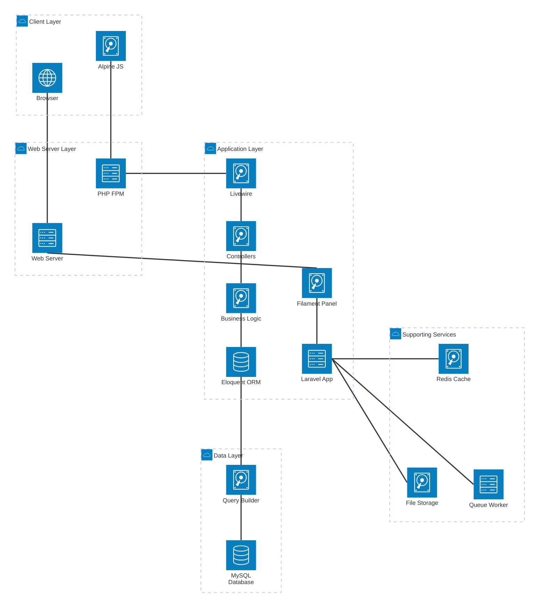
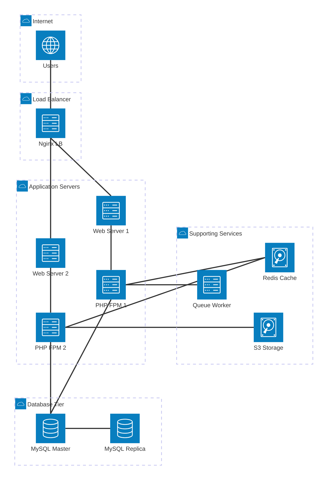
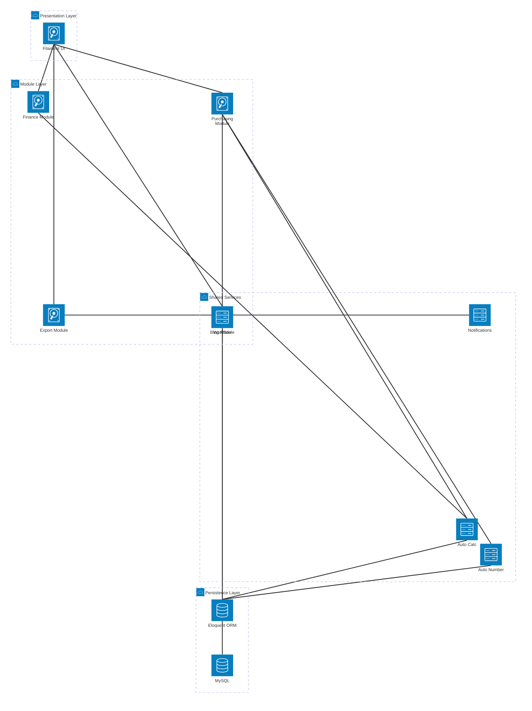
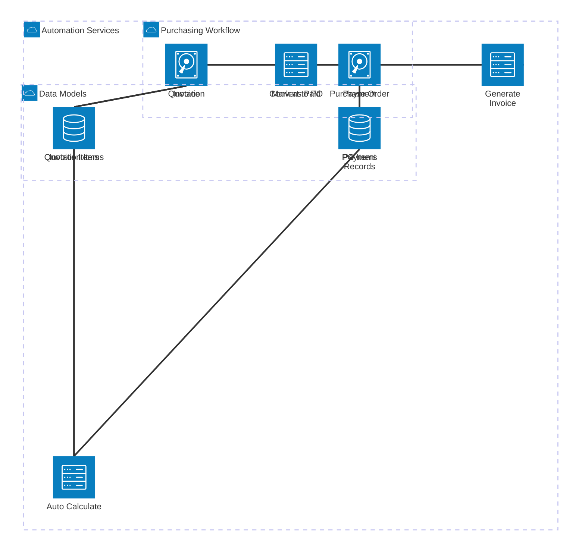
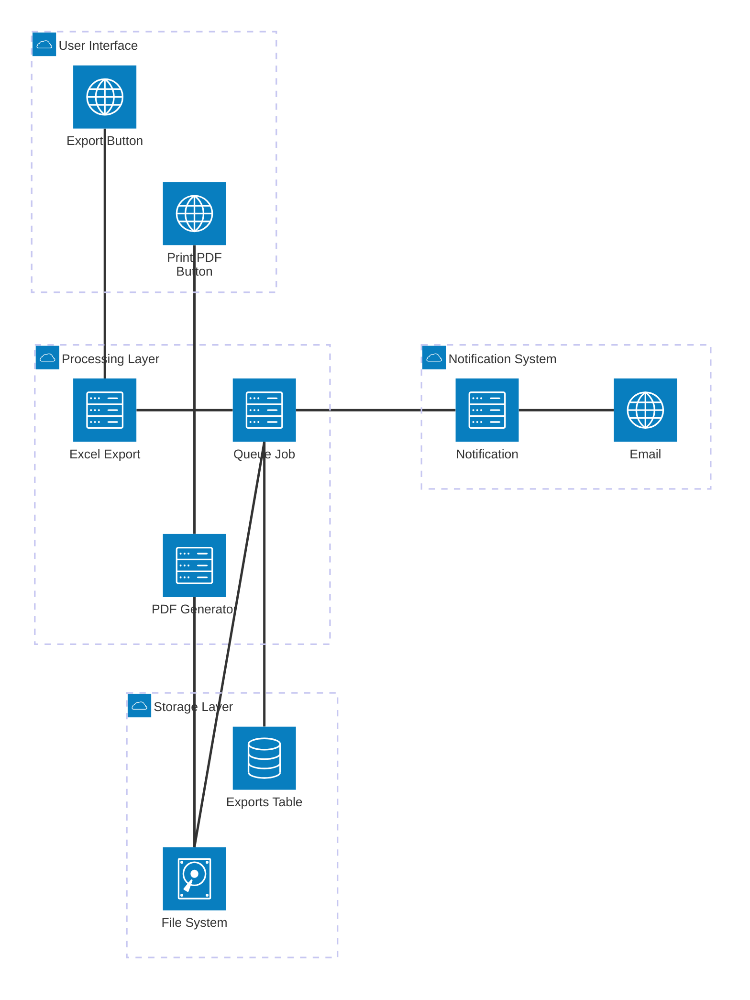
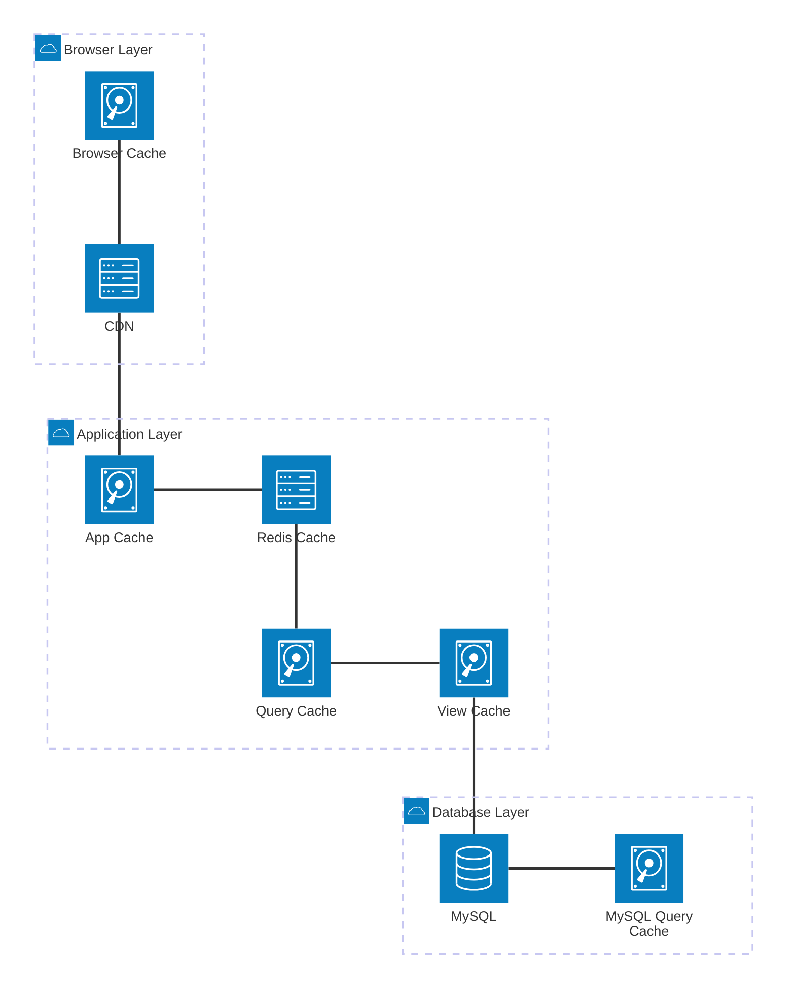

# Mermaid Diagrams for AKPager System

Kumpulan diagram Mermaid yang bisa langsung di-copy paste ke [mermaid.live](https://mermaid.live)

---

## 1. System Architecture Diagram

**Arsitektur sistem lengkap dengan layer-layer utama**



---

## 2. Production Infrastructure Diagram

**Arsitektur production dengan load balancer dan replication**



---

## 3. Module Architecture Diagram

**Arsitektur per modul (Blog, Finance, Purchasing)**



---

## 4. Development Environment Diagram (XAMPP)

**Setup development environment menggunakan XAMPP**


---

## 5. Purchasing Workflow Architecture

**Alur workflow purchasing dari Quotation sampai Payment**



---

## 6. Export & PDF Generation Architecture

**Arsitektur sistem export dan PDF generation**



---

## 7. Security Architecture

**Lapisan keamanan sistem**


---

## 8. Cache Strategy Architecture

**Strategi caching multi-layer**



---

## Cara Penggunaan:

1. **Copy** salah satu diagram di atas (mulai dari ````mermaid` sampai `````)
2. Buka **[mermaid.live](https://mermaid.live)**
3. **Paste** code ke editor
4. Lihat preview diagram di sebelah kanan
5. **Download** sebagai PNG/SVG untuk dokumentasi

## Tips:

-   **Ganti warna**: Ubah `(cloud)`, `(server)`, `(database)`, `(disk)`, `(internet)` untuk icon berbeda
-   **Ubah koneksi**: Gunakan `T` (Top), `B` (Bottom), `L` (Left), `R` (Right) untuk arah panah
-   **Tambah service**: Format: `service name(icon)[Label] in group`
-   **Tambah group**: Format: `group name(icon)[Label]`

## Icon Reference:

-   `(cloud)` - Cloud icon
-   `(server)` - Server icon
-   `(database)` - Database icon
-   `(disk)` - Disk/Storage icon
-   `(internet)` - Globe/Internet icon

---

**Last Updated:** October 31, 2025  
**Project:** AKPager - Smart Manufacturing ERP System
